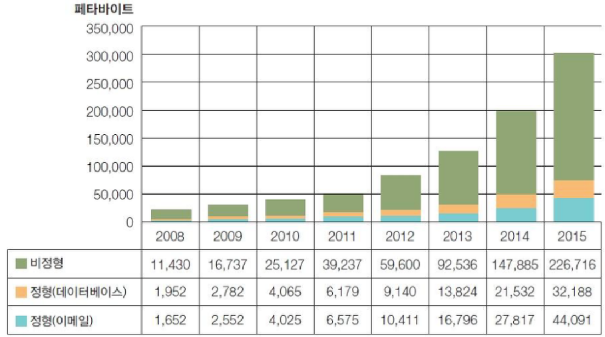
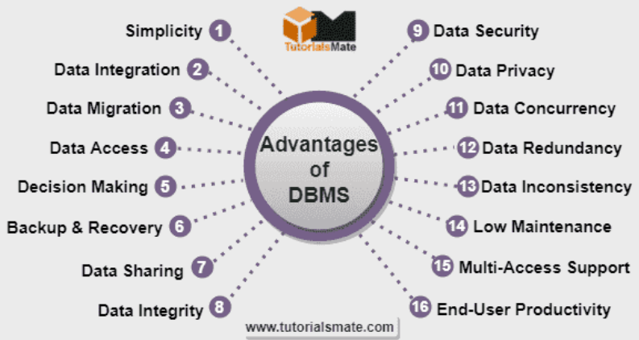
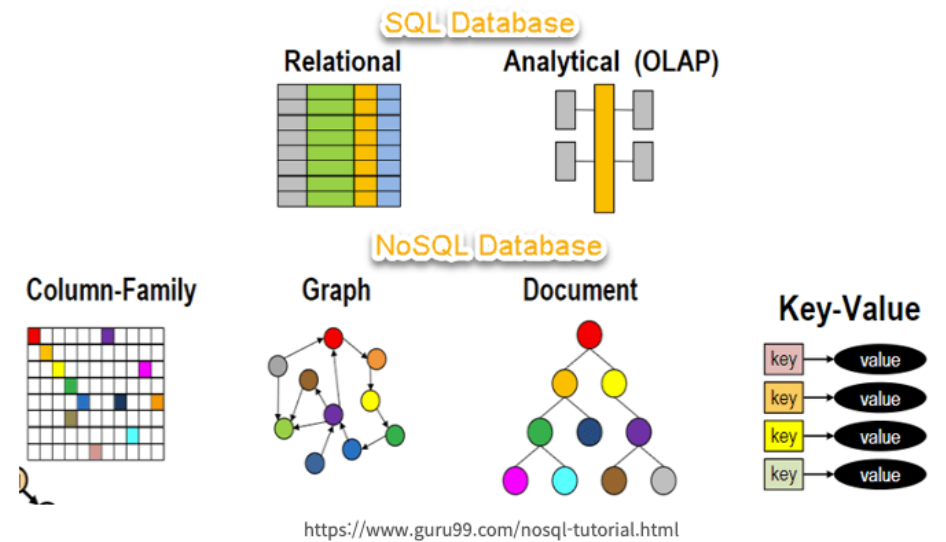
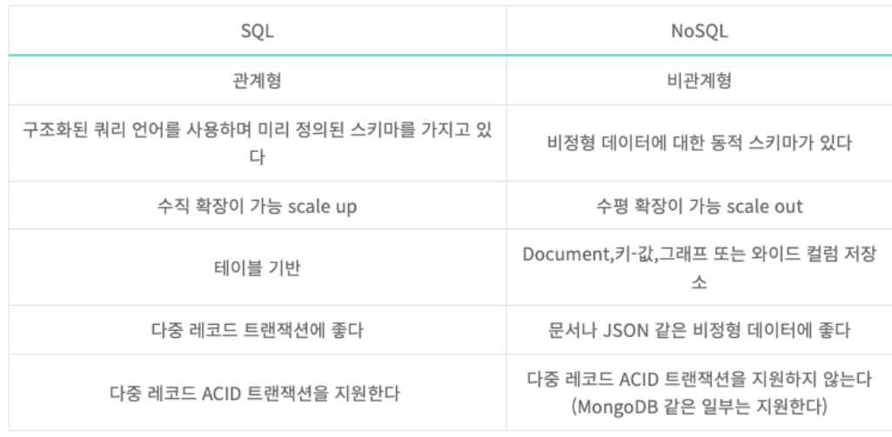
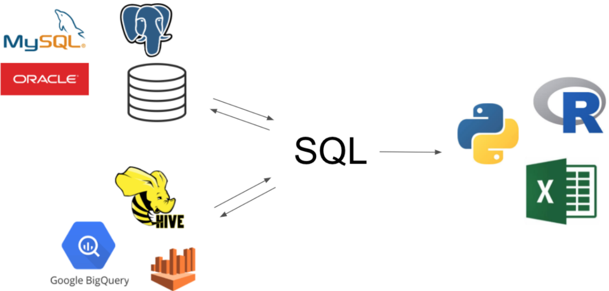
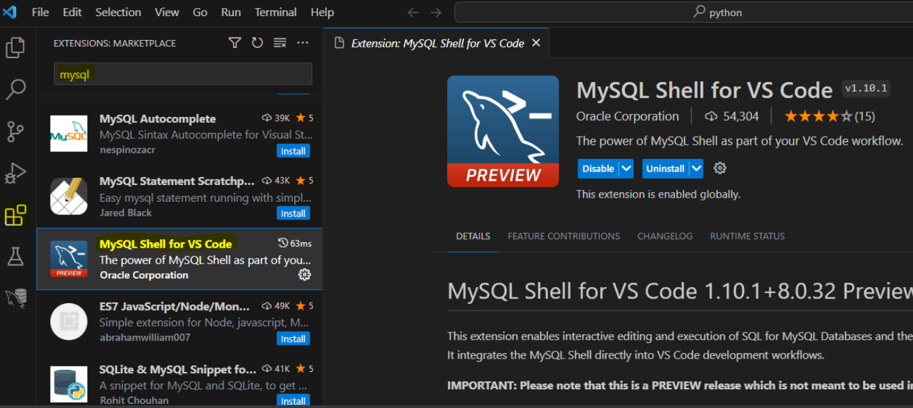
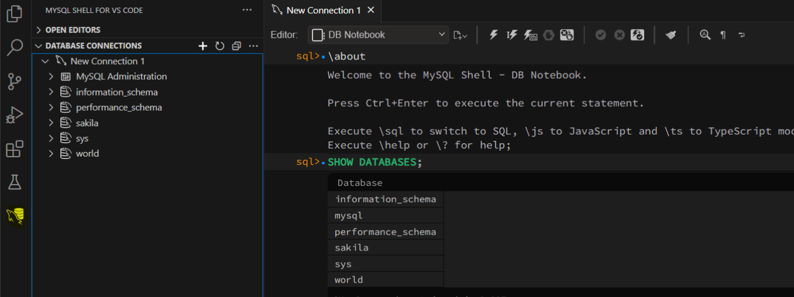

# 데이터(Data)란?
일반적으로 데이터의 종류에는 3가지로 나눌 수 있다. 정형 데이터, 반정형 데이터, 비정형 데이터
- 스키마(schema)
데이터의 구조와 제약 조건에 대한 것들을 정의한 것

---

---
### 정형 데이터(Structured Data)
고정된 필드(스키마를 철저히 따른)에 저장된 데이터 
- 예제: 관계형 데이터베이스, 스프레드시트(엑셀) 등

### 반정형 데이터(Semi-Structured Data)
고정된 필드에 저장되어 있지는 않지만, 메타데이터나 스키마 등을 포함하는 데이터이다. 
- 예제: XML, HTML, JSON, 이메일 등

### 비정형 데이터(Unstructured Data)
고정된 필드에 저장되어 있지 않은 데이터 
- 예제: 텍스트, 이미지, 동영상, 음성 데이터 등

---
# 데이터베이스(DB; Database)
- 데이터베이스를 한 마디로 정의하면 '데이터의 집합'이라고 할 수 있습니다.
- 데이터베이스에는 일상생활 대부분의 정보가 저장되고 관리됩니다. 오늘 보내거나 받은 카카오톡 메시지, 인스타그램에 등록한 사진, 버스/지하철에서 찍은 쿄통카드, 카페에서 구매한 아이스 아메리카노 등의 정보가 모두 데이터베이스에 기록됩니다.

---

---
### 데이터베이스의 특징
- `실시간 접근성(real time accessibility)`: 사용자의 질의에 대하여 즉시 처리하여 응답합니다.
- `계속적인 진화(continuous evolution)`: 삽입, 삭제, 갱신을 통하여 항상 최근의 정확한 데이터를 동적으로 유지합니다.
- `동시 공유(concurrent sharing)`: 여러 사용자가 동시에 원하는 데이터를 공유할 수 있는 특징을 갖습니다.
- `내용에 의한 참조(content reference)`: 데이터베이스에 있는 데이터를 참조할 때 튜플(tuple)의 주소나 위치가 아닌 사용자가 요구하는 데이터 내용에 따라 참조합니다.
- `데이터 논리적 독립성(independence)`: 응용프로그램과 데이터베이스를 독립시킴으로써 데이터 논리적 구조를 변경시키더라도 응용프로그램은 변경되지 않습니다.

---
# 데이터베이스 관리 시스템(DBMS; Database management System)
- DBMS란 데이터베이스를 조작하는 별도의 소프트웨어이다. 
- DBMS를 통해 데이터베이스를 관리하여 응용 프로그램들이 데이터베이스를 공유하고, 사용할 수 있는 환경을 제공합니다.

---

---
## DBMS의 기능
- `정의`: 데이터에 대한 형식, 구조, 제약조건들을 명세하는 기능이다.
- `구축`: DBMS가 관리하는 기억 장치에 데이터를 저장하는 기능이다.
- `조작`: 특정한 데이터를 검색하기 위한 질의, 데이터베이스의 갱신, 보고서 생성 기능 등을 포함한다.
- `공유`: 여러 사용자와 프로그램이 데이터베이스에 동시에 접근하도록 하는 기능이다.
- `보호`: 하드웨어나 소프트웨어의 오작동 또는 권한이 없는 악의적인 접근으로부터 시스템을 보호한다.
- `유지보수`: 시간이 지남에 따라 변화하는 요구사항을 반영할 수 있도록 하는 기능이다.

---

---
## DBMS 유형 
### [Relational DBMS](https://cloud.google.com/learn/what-is-a-relational-database?hl=ko)
- 관계형 데이터베이스 관리 시스템(RDBMS)는 RDB(관계형 데이터베이스)를 관리하는 시스템입니다.
- RDB는 테이블, 행, 열의 정보를 구조화하는 방식을 말합니다. 이를 통해 테이블을 조인하여 정보간 관계 또는 링크를 설정할 수 있는 기능이 있어, 여러 데이터 포인트 간의 관계를 쉽게 이해하고 정보를 얻을 수 있습니다.
- RDBMS 종류:
    -  Oracle, MySQL, PostgreSQL 등

---

---
### NoSQL DBMS
- NoSQL은 비관계형 데이터베이스를 지칭한다. 즉, 관계형 데이터 모델을 지양하며 대향의 분산된 데이터를 저장하고 조회하는데 특화되었으며 스키마 없이 사용 가능하거나 느슨한 스키마를 제공하는 저장소를 말한다.
- NoSQL DBMS 종류:
    - MongoDB, Hbase, DynamoDB 등

---

---
### RDB vs NoSQL DB

---
# [데이터 모델링 & ERD](./데이터%20모델링.md)
- 데이터 모델링이란 정보시스템 구축의 대상이 되는 업무 내용을 분석하여 이해하고 약속된 표기법에 의해 표현하는걸 의미한다. 그리고 이렇게 분석된 모델을 가지고 실제 데이터베이스를 생성하여 개발 및 데이터 관리에 사용된다.
- 특히 데이터를 추상화한 데이터 모델은 데이터베이스의 골격을 이해하고 그 이해를 바탕으로 SQL문장을 기능과 성능적인 측면에서 효율적으로 작성할 수 있기 때문에, 데이터 모델링은 데이터베이스 설계의 핵심 과정이기도 하다.

---
# [데이터베이스 정규화](./데이터베이스%20정규화.md)
데이터 베이스 설계에서 데이터의 중복을 최소화하게 데이터를 구조화 하는 프로세스를 정규화 라고 하는데 정규화의 목표는이상이 있는 관계를 재구성해서 작고 잘 조직된 관계를 생성하는 것

---
# SQL(Structured Query Language)
- 데이터베이스에 접근하고 조작하는 언어
    - `DDL(Data Definition Language)`: 데이터베이스와 테이블을 정의, 수정, 삭제하는 구문
    - `DML(Data Manipulation Language)`: 테이블의 데이터를 삽입, 조회, 수정, 삭제하는 구문
    - `DCL(Data Control Language)`: 데이터의 보안, 무결성, 회복 등을 제어하는 구문

---

---
## [MySQL](./MySQL.md)
- MySQL은 오픈소스 관계형 데이터베이스 관리 시스템입니다.
- 사용자는 SQL이라는 구조화된 쿼리 언어를 사용하여 데이터를 정의, 조작, 제어, 쿼리할 수 있습니다.
- MySQL은 오픈소스이므로 25년 이상 사용자와 긴밀히 협력하여 개발한 여러 기능이 포함되어 있습니다.

---
# [DBeaver](https://dbeaver.io/)
- Community Edition 버전을 사용하면 라이센스(Apache License)가 무료이다.
- 자바/이클립스 기반으로 개발되어서 윈도우, 리눅스, MAC에서 구동된다.
- JDBC 기반으로 DB를 연결해서 그런지 엄청나게 많은 DB를 지원한다. (ORACLE, MySQL, Mariadb, Postgresql, Greenplum ... )
- 개발소스가 공개되어서 버그픽스가 가능하고 새로운 기능을 개발하여 사용이 가능하다.

## [설치방법](https://goddaehee.tistory.com/202) 

---

---

---
- 애러: "Public Key Retrieval is not allowed"

---

---

---

---
## [VS Code](https://marketplace.visualstudio.com/items?itemName=Oracle.mysql-shell-for-vs-code)

---

